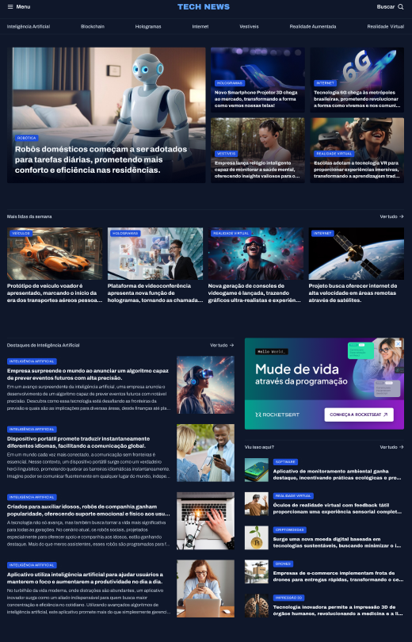

# News Portal

> Página web desenvolvida para um design receptivo e responsivo de um menu principal de uma página focada em notícias sobre o mundo da tecnologia.

O foco do projeto é desenvolver um design responsivo utilizando afunilamento de arquivos, além de CSS Utilitário, aninhamento de tags e responsividade para todos os dispositivos terem a oportunidade de acessar a página combinado com o HTML semântico, e desenvolver uma página de notícias interessante para quem tem interesse no mundo da tecnologia.

## Meta

Gabriel C. Martins – gacmartins@gmail.com

[Meu perfil do Github](https://github.com/Gabriel-Dev-C/)

## Contributing

1. Fork it (<https://github.com/Gabriel-Dev-C/Travelgram/fork>)
2. Create your feature branch (`git checkout -b feature/fooBar`)
3. Commit your changes (`git commit -am 'Add some fooBar'`)
4. Push to the branch (`git push origin feature/fooBar`)
5. Create a new _Pull Request_.
